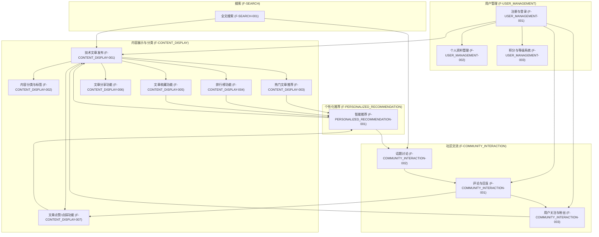
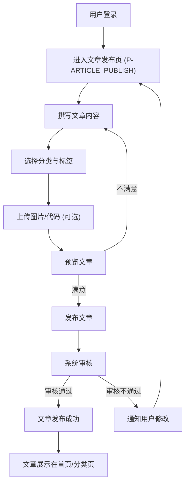
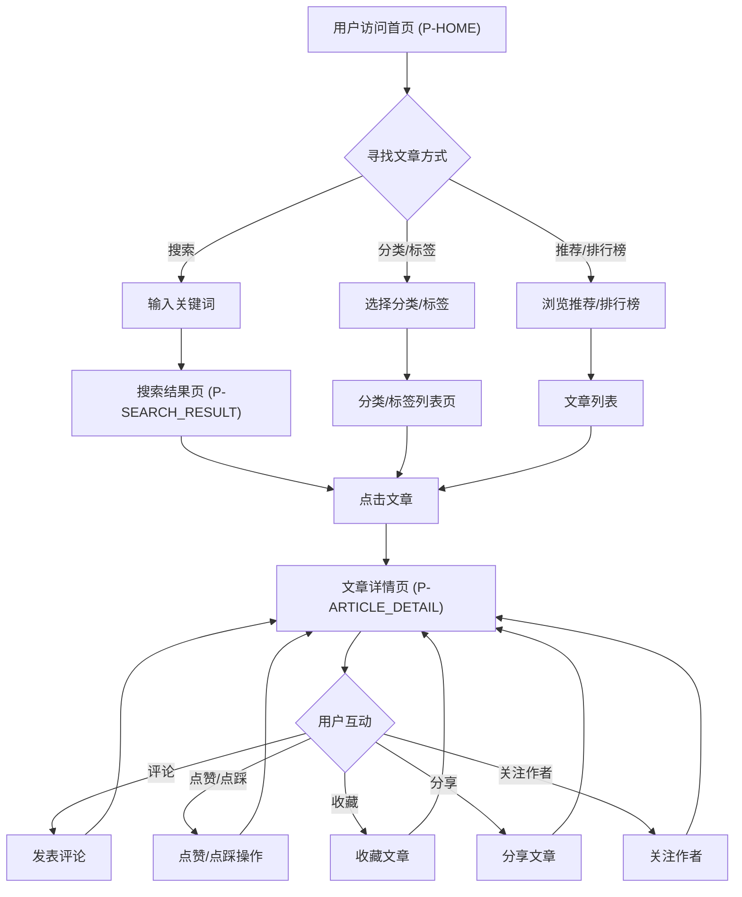
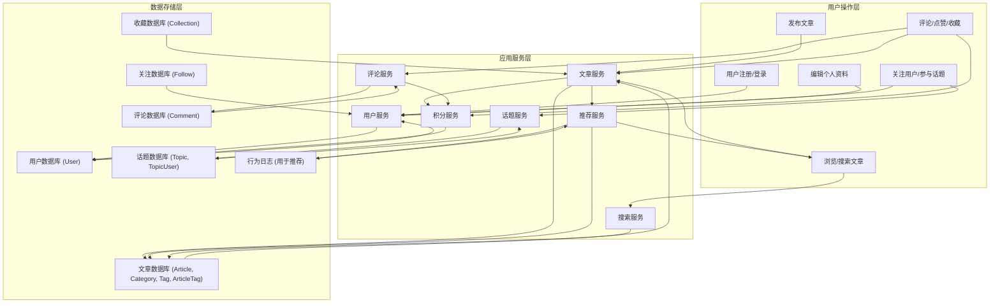

# lectech论坛平台产品需求文档

## 1. 产品概述

### 1.1 产品名称与定位

*   **产品名称:** lectech
*   **产品定位:** 一款专注于技术知识分享、交流与成长的Web端论坛平台，旨在为在校大学生及技术爱好者提供高质量的技术内容、互动社区和个人成长激励。

### 1.2 产品应用语言

*   **产品应用语言:** 中文

### 1.3 产品愿景与目标

*   **产品愿景:** 成为在校大学生和技术爱好者首选的技术学习与交流社区，构建一个充满活力、互助共赢的技术生态。
*   **产品目标:**
    *   提供高质量、易于理解的技术文章，解决用户技术知识获取困难的痛点。
    *   建立活跃的技术交流氛围，促进用户间的互动与经验分享，解决缺乏高质量技术交流平台的问题。
    *   通过积分与等级系统，激励用户创作优质内容和积极参与社区活动，解决个人技术成长缺乏激励的问题。
    *   提供便捷的问答和讨论功能，帮助用户及时解决技术难题。
    *   通过用户关注和话题讨论，帮助用户找到志同道合的技术伙伴。

### 1.4 产品使用终端

*   **主要终端:** Web端桌面应用
*   **浏览器支持:** Chrome 90+、Firefox 88+、Safari 14+、Edge 90+
*   **分辨率支持:** 768x480及以上分辨率，最佳体验为1920x1080
*   **响应式适配:** 支持768px以上的所有桌面和平板设备

### 1.5 核心价值主张

*   **高质量内容:** 专注于原创技术文章，支持Markdown和代码高亮，确保内容专业性和可读性。
*   **活跃社区:** 提供评论、回复、话题讨论、关注等功能，促进用户深度互动。
*   **成长激励:** 积分与等级系统，激励用户持续学习、分享和成长。
*   **个性化体验:** 基于用户行为数据，精准推荐感兴趣的内容。
*   **便捷高效:** 强大的搜索功能和清晰的分类标签，帮助用户快速找到所需信息。

### 1.6 目标用户群体分析

*   **主要用户:** 在校大学生
    *   **特征:** 学习能力强，对新技术充满好奇，渴望实践和交流，但可能缺乏系统学习资源和实践经验，容易遇到编程难题。
    *   **痛点:** 技术知识获取困难，缺乏高质量的技术交流平台，难以找到志同道合的技术伙伴，个人技术成长缺乏激励，技术问题无法及时得到解答。
    *   **需求:** 易于理解的技术文章、实战案例、问题解答、学习路径指导、同伴交流、成就感。
*   **次要用户:** 初级开发者、资深工程师、技术爱好者、IT行业从业者
    *   **特征:** 具有一定技术基础，希望提升技能、分享经验、了解行业动态。
    *   **需求:** 深度技术文章、行业趋势分析、技术难题探讨、个人品牌建设、知识沉淀。

### 1.7 市场需求与竞品简析

*   **市场需求:** 随着互联网技术的发展，技术学习和交流的需求持续增长，尤其是在校大学生群体，对系统性、实战性的技术内容和互动社区有强烈需求。
*   **竞品简析:**
    *   **稀土掘金:** 综合性技术社区，内容丰富，用户活跃度高，提供文章、沸点、小册等多种形式。lectech可借鉴其内容组织、社区互动和激励机制，但在内容深度和垂直领域可进一步深耕。
    *   **CSDN:** 老牌技术社区，内容量大，但内容质量参差不齐，用户体验有待提升。lectech可从用户体验、内容筛选和社区氛围上进行差异化竞争。
    *   **知乎/B站:** 综合性内容平台，部分技术内容质量高，但非垂直社区，技术交流深度有限。lectech可专注于技术领域，提供更专业的交流环境。
*   **lectech优势:** 专注于在校大学生群体，提供更贴近其学习和成长路径的内容与服务，通过积分等级系统强化激励，打造更具归属感的社区。

### 1.8 浏览器兼容性要求

*   **主流浏览器:** 必须完全兼容Chrome、Firefox、Safari、Edge的最新稳定版本。
*   **旧版本兼容:** 对过去一年内发布的浏览器版本提供基本功能兼容，不保证完美视觉效果。
*   **性能优化:** 确保在不同浏览器下均有良好的加载速度和交互响应。

## 2. 功能规格

### 2.1 功能详述

#### 2.1.1 内容展示与分类功能（F-CONTENT_DISPLAY）

*   **F-CONTENT_DISPLAY-001: 技术文章发布**
    *   **描述:** 允许用户发布原创技术文章，支持Markdown语法、代码块语法高亮、图片上传、视频嵌入等，方便用户清晰展示技术内容。
    *   **优先级:** 高
    *   **开发阶段:** 一期
*   **F-CONTENT_DISPLAY-002: 内容分类与标签**
    *   **描述:** 对技术文章进行分类（如前端开发、后端开发、移动开发、人工智能、大数据等），同时设置标签，方便用户根据兴趣快速筛选和查找相关内容。
    *   **优先级:** 高
    *   **开发阶段:** 一期
*   **F-CONTENT_DISPLAY-003: 热门文章推荐**
    *   **描述:** 根据文章的浏览量、点赞数、评论数等数据，推荐热门的技术文章，让用户能够快速发现高质量的内容。
    *   **优先级:** 高
    *   **开发阶段:** 一期
*   **F-CONTENT_DISPLAY-004: 排行榜功能**
    *   **描述:** 设置文章排行榜，如周榜、月榜、年度榜等，展示不同时间段内最受欢迎的文章，激励用户创作优质内容。
    *   **优先级:** 高
    *   **开发阶段:** 一期
*   **F-CONTENT_DISPLAY-005: 文章收藏功能**
    *   **描述:** 用户可以收藏感兴趣的文章，方便后续查阅。
    *   **优先级:** 高
    *   **开发阶段:** 一期
*   **F-CONTENT_DISPLAY-006: 文章分享功能**
    *   **描述:** 用户可以将文章分享到主流社交媒体平台或通过链接分享。
    *   **优先级:** 高
    *   **开发阶段:** 一期
*   **F-CONTENT_DISPLAY-007: 文章点赞/点踩功能**
    *   **描述:** 用户可以对文章进行点赞或点踩，表达对内容的认可或不认可，影响文章热度。
    *   **优先级:** 高
    *   **开发阶段:** 一期

#### 2.1.2 社区交流功能（F-COMMUNITY_INTERACTION）

*   **F-COMMUNITY_INTERACTION-001: 评论与回复**
    *   **描述:** 用户可以在文章下方发表评论，提出问题、分享想法或与其他用户交流讨论，作者和其他用户可以对评论进行回复，形成互动交流的氛围。
    *   **优先级:** 高
    *   **开发阶段:** 一期
*   **F-COMMUNITY_INTERACTION-002: 话题讨论**
    *   **描述:** 创建热门技术话题讨论专栏，用户可以参与讨论，分享自己的观点和经验，了解行业动态和趋势。
    *   **优先级:** 高
    *   **开发阶段:** 一期
*   **F-COMMUNITY_INTERACTION-003: 用户关注与粉丝**
    *   **描述:** 用户可以关注感兴趣的作者，及时获取其发布的新文章和动态，同时也可以拥有自己的粉丝，增加用户之间的互动和粘性。
    *   **优先级:** 高
    *   **开发阶段:** 一期

#### 2.1.3 个性化推荐功能（F-PERSONALIZED_RECOMMENDATION）

*   **F-PERSONALIZED_RECOMMENDATION-001: 智能推荐**
    *   **描述:** 根据用户的浏览历史、点赞、收藏等行为数据，分析用户的兴趣偏好，精准推送相关的技术文章、话题讨论等内容，提高用户发现感兴趣内容的效率。
    *   **优先级:** 高
    *   **开发阶段:** 一期

#### 2.1.4 搜索功能（F-SEARCH）

*   **F-SEARCH-001: 全文搜索**
    *   **描述:** 提供强大的搜索功能，用户可以通过输入关键词、文章标题、作者等信息，快速搜索到自己需要的内容，支持全文检索和模糊搜索。
    *   **优先级:** 高
    *   **开发阶段:** 一期

#### 2.1.5 用户管理功能（F-USER_MANAGEMENT）

*   **F-USER_MANAGEMENT-001: 注册与登录**
    *   **描述:** 支持邮箱注册、手机号注册等多种注册方式，方便用户快速注册账号并登录平台。
    *   **优先级:** 高
    *   **开发阶段:** 一期
*   **F-USER_MANAGEMENT-002: 个人资料管理**
    *   **描述:** 用户可以编辑个人资料，如昵称、头像、个人简介等，展示自己的技术背景和兴趣爱好。
    *   **优先级:** 高
    *   **开发阶段:** 一期
*   **F-USER_MANAGEMENT-003: 积分与等级系统**
    *   **描述:** 设置积分和等级系统，用户通过发布优质文章、参与讨论、获得点赞等行为可以获得积分，提升等级，享受相应的特权和荣誉。
    *   **优先级:** 高
    *   **开发阶段:** 一期

### 2.2 功能模块间的关系图

## 3. 用户流程

### 3.1 用户旅程地图

#### 3.1.1 新用户注册与初次探索

| 阶段 | 用户行为 | 思考/感受 | 痛点/需求 | 触点 | 解决方案 |
|---|---|---|---|---|---|
| **发现** | 通过搜索引擎/推荐发现lectech | “这是个什么平台？” | 了解平台价值 | 搜索引擎、社交媒体 | 简洁的注册/登录页，清晰的平台介绍 |
| **注册** | 选择注册方式，填写信息 | “注册方便吗？信息安全吗？” | 快速便捷注册 | 注册页（P-REGISTER） | 支持邮箱/手机号注册，隐私政策说明 |
| **登录** | 登录平台 | “能记住我吗？下次登录方便吗？” | 记住登录状态 | 登录页（P-LOGIN） | 记住密码功能，多端登录提醒 |
| **初次浏览** | 浏览首页（P-HOME），查看热门文章 | “有什么内容？我感兴趣吗？” | 快速找到感兴趣内容 | 首页（P-HOME） | 热门推荐、分类导航、排行榜 |
| **个人资料完善** | 完善个人资料 | “怎么展示我的技术背景？” | 个人形象展示 | 个人中心页（P-PROFILE） | 昵称、头像、简介编辑 |
| **初步互动** | 尝试点赞、收藏文章 | “操作简单吗？有反馈吗？” | 顺畅的互动体验 | 文章详情页（P-ARTICLE_DETAIL） | 明确的图标和操作反馈 |

#### 3.1.2 用户发布文章流程

| 阶段 | 用户行为 | 思考/感受 | 痛点/需求 | 触点 | 解决方案 |
|---|---|---|---|---|---|
| **创作准备** | 构思文章内容，收集资料 | “写什么？怎么写好？” | 创作灵感、写作工具 | 个人中心页（P-PROFILE） | 提供草稿箱功能 |
| **撰写文章** | 进入文章发布页（P-ARTICLE_PUBLISH），使用Markdown编辑器撰写 | “Markdown好用吗？代码高亮效果如何？” | 强大的编辑功能 | 文章发布页（P-ARTICLE_PUBLISH） | 支持Markdown、代码高亮、实时预览 |
| **选择分类与标签** | 为文章选择合适的分类和标签 | “哪个分类最合适？标签怎么选？” | 精准分类、易于检索 | 文章发布页（P-ARTICLE_PUBLISH） | 提供分类列表、标签推荐、搜索功能 |
| **上传图片/代码** | 上传文章所需图片或代码块 | “图片上传方便吗？代码块能直接粘贴吗？” | 便捷的媒体插入 | 文章发布页（P-ARTICLE_PUBLISH） | 支持拖拽上传、代码块自动识别 |
| **预览与发布** | 预览文章效果，确认无误后发布 | “发布后效果如何？能修改吗？” | 发布前确认、发布后管理 | 文章发布页（P-ARTICLE_PUBLISH） | 实时预览、发布后可编辑 |
| **等待审核** | 文章发布后等待平台审核 | “多久能审核通过？审核标准是什么？” | 审核透明度 | 个人中心页（P-PROFILE） | 审核状态提示、审核规范说明 |
| **获得反馈** | 文章发布后收到点赞、评论、收藏 | “我的文章受欢迎吗？有人讨论吗？” | 获得认可、互动反馈 | 个人中心页（P-PROFILE）、文章详情页（P-ARTICLE_DETAIL） | 消息通知、评论区互动 |

#### 3.1.3 用户阅读与交流流程

| 阶段 | 用户行为 | 思考/感受 | 痛点/需求 | 触点 | 解决方案 |
|---|---|---|---|---|---|
| **寻找内容** | 通过搜索、分类、标签、推荐、排行榜寻找感兴趣的文章 | “怎么快速找到我需要的内容？” | 高效内容发现 | 首页（P-HOME）、搜索结果页（P-SEARCH_RESULT）、排行榜页（P-RANKING） | 强大的搜索、清晰的分类、智能推荐 |
| **阅读文章** | 点击文章进入文章详情页（P-ARTICLE_DETAIL）阅读 | “内容清晰吗？排版舒服吗？” | 良好的阅读体验 | 文章详情页（P-ARTICLE_DETAIL） | 简洁的页面布局、清晰的字体排版 |
| **互动交流** | 在文章下方评论、回复，或参与话题讨论 | “我的问题能得到解答吗？能和作者交流吗？” | 深度互动、问题解决 | 文章详情页（P-ARTICLE_DETAIL）、话题讨论页（P-TOPIC_DISCUSSION） | 评论区、回复功能、话题讨论区 |
| **收藏/分享** | 收藏文章或分享给他人 | “方便保存吗？能分享给朋友吗？” | 内容管理、传播 | 文章详情页（P-ARTICLE_DETAIL） | 收藏按钮、分享按钮 |
| **关注作者** | 关注感兴趣的作者 | “怎么获取作者最新动态？” | 持续获取优质内容 | 文章详情页（P-ARTICLE_DETAIL）、个人中心页（P-PROFILE） | 关注按钮、作者主页 |
| **积分与等级提升** | 通过互动行为获得积分，提升等级 | “我能获得什么奖励？等级有什么用？” | 成长激励、荣誉感 | 个人中心页（P-PROFILE） | 积分等级展示、特权说明 |

### 3.2 关键业务流程图

#### 3.2.1 用户发布文章流程

#### 3.2.2 用户阅读文章与互动流程

### 3.3 各场景下的用户操作步骤

#### 3.3.1 发布一篇技术文章

1.  用户登录lectech平台。
2.  在顶部导航栏或个人中心页（P-PROFILE）找到“发布文章”入口，点击进入文章发布页（P-ARTICLE_PUBLISH）。
3.  在编辑器中撰写文章标题和正文内容，支持Markdown语法，可插入代码块、图片、视频等。
4.  在右侧或底部选择文章所属分类（如“前端开发”）和添加相关标签（如“Vue”、“React”）。
5.  点击“预览”按钮，检查文章排版和内容效果。
6.  确认无误后，点击“发布”按钮。
7.  系统提示文章已提交审核，用户可在个人中心页（P-PROFILE）查看文章状态。

#### 3.3.2 寻找并阅读一篇感兴趣的技术文章

1.  用户访问lectech首页（P-HOME）。
2.  **方式一：通过搜索**
    *   在顶部导航栏的搜索框中输入关键词（如“Python爬虫”），按回车或点击搜索按钮。
    *   进入搜索结果页（P-SEARCH_RESULT），浏览搜索结果列表。
    *   点击感兴趣的文章标题，进入文章详情页（P-ARTICLE_DETAIL）。
3.  **方式二：通过分类/标签筛选**
    *   在首页（P-HOME）或文章列表页（P-ARTICLE_LIST）的分类导航中选择感兴趣的分类（如“人工智能”）。
    *   进入该分类下的文章列表页（P-ARTICLE_LIST），浏览文章。
    *   点击感兴趣的文章标题，进入文章详情页（P-ARTICLE_DETAIL）。
4.  **方式三：浏览热门推荐/排行榜**
    *   在首页（P-HOME）浏览“热门文章推荐”区域或点击“排行榜入口”进入排行榜页（P-RANKING）。
    *   浏览推荐列表或排行榜，点击感兴趣的文章标题，进入文章详情页（P-ARTICLE_DETAIL）。
5.  在文章详情页（P-ARTICLE_DETAIL）阅读文章内容。
6.  阅读过程中，可进行点赞、点踩、收藏、分享等操作。
7.  在文章底部评论区发表评论或回复其他用户的评论。
8.  如果对作者感兴趣，可点击作者头像或昵称进入其个人主页，并选择“关注”该作者。

## 4. 数据流设计

### 4.1 数据结构与关系

#### 4.1.1 用户（User）

| 字段名 | 数据类型 | 描述 | 备注 |
|---|---|---|---|
| `user_id` | UUID | 用户唯一标识 | 主键 |
| `username` | String | 用户名/昵称 | 唯一，可修改 |
| `email` | String | 邮箱 | 唯一，用于登录和找回密码 |
| `phone_number` | String | 手机号 | 唯一，用于登录和找回密码（可选） |
| `password_hash` | String | 密码哈希值 | 加密存储 |
| `avatar_url` | String | 头像URL | |
| `bio` | Text | 个人简介 | |
| `registration_date` | Timestamp | 注册时间 | |
| `last_login_date` | Timestamp | 最后登录时间 | |
| `points` | Integer | 积分 | 默认0 |
| `level` | Integer | 等级 | 默认1 |

#### 4.1.2 文章（Article）

| 字段名 | 数据类型 | 描述 | 备注 |
|---|---|---|---|
| `article_id` | UUID | 文章唯一标识 | 主键 |
| `author_id` | UUID | 作者ID | 外键，关联User表 |
| `title` | String | 文章标题 | |
| `content_markdown` | Text | 文章Markdown内容 | |
| `content_html` | Text | 文章渲染后的HTML内容 | |
| `category_id` | UUID | 分类ID | 外键，关联Category表 |
| `status` | Enum | 文章状态 | 草稿/待审核/已发布/已下架 |
| `publish_date` | Timestamp | 发布时间 | |
| `last_modified_date` | Timestamp | 最后修改时间 | |
| `view_count` | Integer | 浏览量 | 默认0 |
| `like_count` | Integer | 点赞数 | 默认0 |
| `dislike_count` | Integer | 点踩数 | 默认0 |
| `comment_count` | Integer | 评论数 | 默认0 |

#### 4.1.3 分类（Category）

| 字段名 | 数据类型 | 描述 | 备注 |
|---|---|---|---|
| `category_id` | UUID | 分类唯一标识 | 主键 |
| `name` | String | 分类名称 | 如“前端开发” |
| `description` | Text | 分类描述 | |

#### 4.1.4 标签（Tag）

| 字段名 | 数据类型 | 描述 | 备注 |
|---|---|---|---|
| `tag_id` | UUID | 标签唯一标识 | 主键 |
| `name` | String | 标签名称 | 如“Vue” |

#### 4.1.5 文章-标签关联（ArticleTag）

| 字段名 | 数据类型 | 描述 | 备注 |
|---|---|---|---|
| `article_id` | UUID | 文章ID | 联合主键，外键 |
| `tag_id` | UUID | 标签ID | 联合主键，外键 |

#### 4.1.6 评论（Comment）

| 字段名 | 数据类型 | 描述 | 备注 |
|---|---|---|---|
| `comment_id` | UUID | 评论唯一标识 | 主键 |
| `article_id` | UUID | 评论所属文章ID | 外键，关联Article表 |
| `user_id` | UUID | 评论用户ID | 外键，关联User表 |
| `parent_comment_id` | UUID | 父评论ID | 自关联，用于回复，可为空 |
| `content` | Text | 评论内容 | |
| `publish_date` | Timestamp | 发布时间 | |
| `like_count` | Integer | 点赞数 | 默认0 |

#### 4.1.7 收藏（Collection）

| 字段名 | 数据类型 | 描述 | 备注 |
|---|---|---|---|
| `collection_id` | UUID | 收藏唯一标识 | 主键 |
| `user_id` | UUID | 用户ID | 外键，关联User表 |
| `article_id` | UUID | 文章ID | 外键，关联Article表 |
| `collect_date` | Timestamp | 收藏时间 | |

#### 4.1.8 关注（Follow）

| 字段名 | 数据类型 | 描述 | 备注 |
|---|---|---|---|
| `follower_id` | UUID | 关注者ID | 外键，关联User表 |
| `followed_id` | UUID | 被关注者ID | 外键，关联User表 |
| `follow_date` | Timestamp | 关注时间 | |

#### 4.1.9 话题（Topic）

| 字段名 | 数据类型 | 描述 | 备注 |
|---|---|---|---|
| `topic_id` | UUID | 话题唯一标识 | 主键 |
| `title` | String | 话题标题 | |
| `description` | Text | 话题描述 | |
| `creator_id` | UUID | 创建者ID | 外键，关联User表 |
| `create_date` | Timestamp | 创建时间 | |
| `discussion_count` | Integer | 讨论数 | 默认0 |

#### 4.1.10 话题-用户关联（TopicUser）

| 字段名 | 数据类型 | 描述 | 备注 |
|---|---|---|---|
| `topic_id` | UUID | 话题ID | 联合主键，外键 |
| `user_id` | UUID | 用户ID | 联合主键，外键 |
| `join_date` | Timestamp | 加入时间 | |

### 4.2 关键数据流向图

### 4.3 数据存储与处理原则

*   **数据安全:** 所有用户敏感信息（如密码）必须加密存储。
*   **数据一致性:** 确保多表操作的数据一致性，例如文章点赞数与实际点赞记录保持同步。
*   **数据备份与恢复:** 定期进行数据备份，并制定数据恢复策略。
*   **性能优化:** 针对高并发读写场景（如文章浏览量、点赞数），采用缓存机制和读写分离策略。
*   **推荐算法:** 行为日志数据用于个性化推荐算法的训练和实时推荐。
*   **数据统计:** 定期对文章浏览量、点赞数、评论数等进行统计，用于排行榜和热门推荐。
*   **积分计算:** 积分系统根据用户行为实时或定时计算并更新用户积分和等级。

## 5. 页面规格

### 5.1 页面概览

#### 5.1.1 整体布局架构

*   **布局模式:** Web端响应式布局 - 顶部导航栏 + 主内容区(最小720px) + 可选左侧菜单(200-240px/48-56px) + 可选右侧面板(280-320px)
*   **空间分配策略:**
    *   大屏幕(≥1440px): 顶部60px + 左侧200-240px(可选) + 主内容区(动态) + 右侧280-320px(可选)
    *   中屏幕(1200-1439px): 顶部60px + 左侧200-240px(可选) + 主内容区(充满剩余空间)
    *   小屏幕(768-1199px): 顶部60px + 左侧菜单(折叠/抽屉，可选) + 主内容区(充满)
*   **导航体系:** 顶部主导航 + 左侧功能菜单(可选) + 面包屑导航(可选)
*   **交互模式:** 页面切换 + 模态弹窗 + 侧边抽屉 + 右键菜单
*   **右侧面板使用:** 根据功能需要合理使用，提供辅助功能，严格遵循使用限制。

#### 5.1.2 页面列表

| 页面ID | 页面名称 | 核心功能 | 布局类型 | 右侧面板 |
|---|---|---|---|---|
| P-HOME | 首页 | 内容展示、导航入口、热门推荐、最新文章 | 二栏布局（左侧菜单+主内容区） | 慎用(仅在≥1440px且必要时) |
| P-ARTICLE_DETAIL | 文章详情页 | 文章内容展示、评论互动、点赞收藏分享 | 二栏布局（左侧菜单+主内容区） | 慎用(仅在≥1440px且必要时) |
| P-ARTICLE_PUBLISH | 文章发布页 | 文章撰写、编辑、发布 | 二栏布局（左侧菜单+主内容区） | 不使用 |
| P-PROFILE | 个人中心页 | 个人资料管理、我的文章、我的收藏、积分等级 | 二栏布局（左侧菜单+主内容区） | 不使用 |
| P-SEARCH_RESULT | 搜索结果页 | 搜索结果展示、筛选 | 二栏布局（左侧菜单+主内容区） | 不使用 |
| P-TOPIC_DISCUSSION | 话题讨论页 | 话题列表、话题详情、参与讨论 | 二栏布局（左侧菜单+主内容区） | 慎用(仅在≥1440px且必要时) |
| P-RANKING | 排行榜页 | 文章排行榜展示（周/月/年） | 二栏布局（左侧菜单+主内容区） | 不使用 |
| P-LOGIN | 登录页 | 用户登录 | 单栏布局 | 不使用 |
| P-REGISTER | 注册页 | 用户注册 | 单栏布局 | 不使用 |

### 5.2 页面详情

#### 5.2.1 首页（P-HOME）

**布局架构设计：**
- 页面类型：综合展示页面，包含核心内容展示和导航功能。
- 布局模式：二栏布局（左侧菜单+主内容区），在大屏幕下（≥1440px）可考虑右侧面板。
- 空间分配：顶部导航 + 左侧菜单 + 主内容区 + 可选右侧面板。

**页面布局架构：**
- 顶部导航栏：Logo、主导航菜单（首页、话题、排行榜）、搜索框、登录/注册入口、用户头像（登录后） - 建议高度60px，固定定位。
- 左侧菜单：文章分类导航（前端开发、后端开发、移动开发、人工智能、大数据等） - 建议宽度200-240px(展开)/48-56px(折叠)。
- 主内容区域：核心展示区域，建议最小宽度720px。
  - 页面头部：页面标题（如“最新文章”）、面包屑导航（可选） - 建议高度48-60px。
  - 工具栏区域：筛选条件（如按时间、按热度）、视图切换（可选） - 建议高度40-48px。
  - 内容展示区域：
    - 热门文章推荐区：卡片或列表形式展示热门文章，可轮播或多列布局。
    - 最新文章列表：文章列表，每项包含标题、作者、发布时间、简介、分类标签、浏览/点赞/评论数。
  - 分页区域：分页控件、内容总数信息 - 建议高度40px。
- 右侧面板：**慎用**：仅在屏幕宽度≥1440px且功能确实必要时使用，辅助功能区域，宽度280-320px（**严格要求：必须在布局中占据独立空间，绝对不能遮挡主内容，且需确保主内容区宽度≥720px**）。
  - 推荐内容：个性化推荐文章列表（非关键信息）。
  - 热门话题入口：热门话题列表或入口（非核心功能）。
  - 广告/公告区：平台公告或推广内容（必须在主内容区有完整替代方案）。

**响应式适配策略：**
- 大屏幕(≥1440px)：二栏布局，左侧200-240px + 主内容区(≥720px) + 右侧280-320px（**所有面板均占据布局空间，严禁遮挡**）。
- 中屏幕(1200-1439px)：二栏布局，**严禁使用右侧面板**，左侧200-240px + 主内容区充满剩余空间。
- 小屏幕(768-1199px)：左侧菜单折叠或抽屉式，主内容区充满，文章列表可调整为2列布局（**抽屉式菜单需用户主动触发**）。
- 移动端(<768px)：单栏布局，左侧菜单抽屉式，内容单列显示，保持核心功能（**所有侧边面板均隐藏或抽屉化**）。

**组件尺寸规范：**
- 按钮尺寸：主要操作按钮36px高度，次要按钮32px高度。
- 输入框：搜索框36px高度。
- 内容卡片：建议最小高度120px，宽度自适应，最小200px。
- 列表行高：文章列表行高48px。
- 图标尺寸：导航图标20px，操作图标16px。
- 间距规范：卡片间距16px，区域间距20px，组件内间距12px。

**核心功能：**
文章浏览、分类导航、热门推荐、最新文章展示、搜索入口、登录/注册入口、话题讨论入口、排行榜入口。

**数据结构：**
| 列名 | 数据类型 | 宽度建议 | 是否可排序 | 操作功能 |
|---|---|---|---|---|
| 标题 | 文本+链接 | 200px | 是 | 点击进入文章详情页（P-ARTICLE_DETAIL） |
| 作者 | 文本+链接 | 100px | 是 | 点击进入个人中心页（P-PROFILE） |
| 发布时间 | 日期时间 | 120px | 是 | 时间排序 |
| 简介 | 文本 | 动态 | 否 | 无 |
| 分类 | 标签 | 80px | 是 | 点击筛选分类 |
| 标签 | 标签 | 120px | 是 | 点击筛选标签 |
| 浏览量 | 数字 | 60px | 是 | 浏览量排序 |
| 点赞数 | 数字 | 60px | 是 | 点赞数排序 |
| 评论数 | 数字 | 60px | 是 | 评论数排序 |

**交互设计：**
- 鼠标交互：文章卡片/列表项悬停显示阴影或高亮效果，点赞/收藏/分享按钮悬停显示提示。
- 键盘交互：Tab键导航，Enter键确认搜索。
- 状态管理：用户登录状态、搜索历史、筛选条件保持。

**页面间跳转关系：**
| 触发组件 | 交互类型 | 目标页面 | 传递参数 | 展示方式 |
|---|---|---|---|---|
| 文章标题/卡片 | 点击 | 文章详情页（P-ARTICLE_DETAIL） | article_id | 页面跳转 |
| 作者昵称/头像 | 点击 | 个人中心页（P-PROFILE） | user_id | 页面跳转 |
| 分类标签 | 点击 | 搜索结果页（P-SEARCH_RESULT） | category_id | 页面跳转 |
| 顶部搜索框 | 输入+回车/点击 | 搜索结果页（P-SEARCH_RESULT） | keyword | 页面跳转 |
| 登录入口 | 点击 | 登录页（P-LOGIN） | 无 | 页面跳转 |
| 注册入口 | 点击 | 注册页（P-REGISTER） | 无 | 页面跳转 |
| 话题导航 | 点击 | 话题讨论页（P-TOPIC_DISCUSSION） | 无 | 页面跳转 |
| 排行榜入口 | 点击 | 排行榜页（P-RANKING） | 无 | 页面跳转 |
| 用户头像（登录后） | 点击 | 个人中心页（P-PROFILE） | 无 | 页面跳转 |

#### 5.2.2 文章详情页（P-ARTICLE_DETAIL）

**布局架构设计：**
- 页面类型：内容详情页。
- 布局模式：二栏布局（左侧菜单+主内容区），在大屏幕下（≥1440px）可考虑右侧面板。
- 空间分配：顶部导航 + 左侧菜单 + 主内容区 + 可选右侧面板。

**页面布局架构：**
- 顶部导航栏：同首页（P-HOME） - 建议高度60px，固定定位。
- 左侧菜单：同首页（P-HOME） - 建议宽度200-240px(展开)/48-56px(折叠)。
- 主内容区域：核心展示区域，建议最小宽度720px。
  - 页面头部：文章标题、作者信息（头像、昵称、关注按钮）、发布时间、浏览量、分类标签、面包屑导航 - 建议高度80-100px。
  - 内容展示区域：文章正文内容，支持Markdown渲染，代码块高亮，图片、视频展示 - 自适应高度。
  - 操作区域：点赞/点踩按钮、收藏按钮、分享按钮（微信、微博、复制链接等） - 建议高度40px。
  - 评论区：评论列表、评论输入框、回复功能 - 自适应高度。
  - 相关文章推荐：基于当前文章内容或用户兴趣推荐相关文章列表 - 建议高度200-300px。
- 右侧面板：**慎用**：仅在屏幕宽度≥1440px且功能确实必要时使用，辅助功能区域，宽度280-320px（**严格要求：必须在布局中占据独立空间，绝对不能遮挡主内容，且需确保主内容区宽度≥720px**）。
  - 作者信息卡片：作者简介、近期文章、关注按钮（非核心功能）。
  - 文章目录：文章标题的目录导航（非关键信息）。
  - 热门评论：精选热门评论（必须在主内容区有完整替代方案）。

**响应式适配策略：**
- 大屏幕(≥1440px)：二栏布局，左侧200-240px + 主内容区(≥720px) + 右侧280-320px（**所有面板均占据布局空间，严禁遮挡**）。
- 中屏幕(1200-1439px)：二栏布局，**严禁使用右侧面板**，左侧200-240px + 主内容区充满剩余空间。
- 小屏幕(768-1199px)：左侧菜单折叠或抽屉式，主内容区充满，评论区可调整布局（**抽屉式菜单需用户主动触发**）。
- 移动端(<768px)：单栏布局，左侧菜单抽屉式，内容单列显示，保持核心功能（**所有侧边面板均隐藏或抽屉化**）。

**组件尺寸规范：**
- 按钮尺寸：点赞/收藏/分享按钮32px高度。
- 输入框：评论输入框36px高度。
- 评论行高：评论列表行高40-60px。
- 图标尺寸：操作图标16px。
- 间距规范：内容段落间距16px，评论间距12px。

**核心功能：**
文章内容展示、评论与回复、点赞/点踩、收藏、分享、关注作者、相关文章推荐。

**交互设计：**
- 鼠标交互：点赞/收藏/分享按钮悬停效果，评论区头像/昵称悬停显示用户信息卡片，右键菜单（可选，如复制链接）。
- 键盘交互：Tab键导航评论区，Enter键提交评论。
- 状态管理：用户点赞/收藏状态、评论输入框内容保持。

**页面间跳转关系：**
| 触发组件 | 交互类型 | 目标页面 | 传递参数 | 展示方式 |
|---|---|---|---|---|
| 作者昵称/头像 | 点击 | 个人中心页（P-PROFILE） | user_id | 页面跳转 |
| 分类标签 | 点击 | 搜索结果页（P-SEARCH_RESULT） | category_id | 页面跳转 |
| 相关文章标题 | 点击 | 文章详情页（P-ARTICLE_DETAIL） | article_id | 页面跳转 |
| 评论区回复按钮 | 点击 | 文章详情页（P-ARTICLE_DETAIL） | comment_id | 评论区内回复表单展开 |
| 关注按钮 | 点击 | 无 | user_id | 页面内状态更新 |
| 分享按钮 | 点击 | 无 | article_id | 模态弹窗（分享选项） |
| 收藏按钮 | 点击 | 无 | article_id | 页面内状态更新 |
| 顶部导航栏 | 点击 | 首页（P-HOME）/话题讨论页（P-TOPIC_DISCUSSION）/排行榜页（P-RANKING） | 无 | 页面跳转 |

#### 5.2.3 文章发布页（P-ARTICLE_PUBLISH）

**布局架构设计：**
- 页面类型：表单页。
- 布局模式：二栏布局（左侧菜单+主内容区）。
- 空间分配：顶部导航 + 左侧菜单 + 主内容区。

**页面布局架构：**
- 顶部导航栏：同首页（P-HOME） - 建议高度60px，固定定位。
- 左侧菜单：同首页（P-HOME），可高亮“发布文章”菜单项 - 建议宽度200-240px(展开)/48-56px(折叠)。
- 主内容区域：核心表单区域，建议最小宽度720px。
  - 页面头部：页面标题“发布文章”、面包屑导航 - 建议高度48-60px。
  - 内容编辑区：
    - 文章标题输入框：单行文本输入。
    - Markdown编辑器：支持Markdown语法输入、代码块高亮、图片上传、实时预览区域。
  - 侧边/底部配置区：
    - 分类选择：下拉选择框或标签组选择。
    - 标签输入：支持多标签输入，自动补全或推荐。
    - 发布按钮、保存草稿按钮、取消按钮。

**响应式适配策略：**
- 大屏幕(≥1440px)：二栏布局，左侧200-240px + 主内容区(≥720px)。
- 中屏幕(1200-1439px)：二栏布局，左侧200-240px + 主内容区充满剩余空间。
- 小屏幕(768-1199px)：左侧菜单折叠或抽屉式，主内容区充满，编辑器和配置区可调整为上下布局（**抽屉式菜单需用户主动触发**）。
- 移动端(<768px)：单栏布局，左侧菜单抽屉式，编辑器和配置区单列显示，保持核心功能（**所有侧边面板均隐藏或抽屉化**）。

**组件尺寸规范：**
- 按钮尺寸：发布/保存/取消按钮36px高度。
- 输入框：标题输入框40px高度，编辑器高度自适应。
- 间距规范：表单项间距16px，区域间距24px。

**核心功能：**
文章标题输入、Markdown内容编辑、代码块高亮、图片上传、分类选择、标签添加、文章预览、发布文章、保存草稿。

**交互设计：**
- 鼠标交互：编辑器工具栏按钮悬停效果，拖拽图片上传。
- 键盘交互：Tab键导航表单项，Ctrl+S保存草稿（可选），Enter键提交（在特定输入框）。
- 状态管理：编辑器内容自动保存草稿（可选），表单填写状态保持。

**页面间跳转关系：**
| 触发组件 | 交互类型 | 目标页面 | 传递参数 | 展示方式 |
|---|---|---|---|---|
| 发布按钮 | 点击 | 个人中心页（P-PROFILE） | 无 | 页面跳转（发布成功后） |
| 保存草稿按钮 | 点击 | 个人中心页（P-PROFILE） | 无 | 页面跳转（保存成功后） |
| 取消按钮 | 点击 | 个人中心页（P-PROFILE） | 无 | 页面跳转 |
| 顶部导航栏 | 点击 | 首页（P-HOME）/话题讨论页（P-TOPIC_DISCUSSION）/排行榜页（P-RANKING） | 无 | 页面跳转 |

#### 5.2.4 个人中心页（P-PROFILE）

**布局架构设计：**
- 页面类型：个人信息管理页。
- 布局模式：二栏布局（左侧菜单+主内容区）。
- 空间分配：顶部导航 + 左侧菜单 + 主内容区。

**页面布局架构：**
- 顶部导航栏：同首页（P-HOME） - 建议高度60px，固定定位。
- 左侧菜单：个人中心导航菜单（我的文章、我的收藏、我的评论、我的积分与等级、我的关注/粉丝、编辑资料） - 建议宽度200-240px(展开)/48-56px(折叠)。
- 主内容区域：核心展示区域，建议最小宽度720px。
  - 页面头部：用户头像、昵称、个人简介、积分等级展示 - 建议高度100-150px。
  - 内容展示区域：根据左侧菜单选择，显示对应内容：
    - 我的文章：已发布文章列表、草稿箱列表。
    - 我的收藏：收藏文章列表。
    - 我的评论：用户发表的评论列表。
    - 我的积分与等级：积分明细、等级特权说明。
    - 我的关注/粉丝：关注列表、粉丝列表。
    - 编辑资料：个人资料编辑表单（昵称、头像、简介等）。
  - 分页区域：分页控件、内容总数信息（适用于列表类内容） - 建议高度40px。

**响应式适配策略：**
- 大屏幕(≥1440px)：二栏布局，左侧200-240px + 主内容区(≥720px)。
- 中屏幕(1200-1439px)：二栏布局，左侧200-240px + 主内容区充满剩余空间。
- 小屏幕(768-1199px)：左侧菜单折叠或抽屉式，主内容区充满，内容列表可调整为2列布局（**抽屉式菜单需用户主动触发**）。
- 移动端(<768px)：单栏布局，左侧菜单抽屉式，内容单列显示，保持核心功能（**所有侧边面板均隐藏或抽屉化**）。

**组件尺寸规范：**
- 按钮尺寸：编辑按钮32px高度。
- 输入框：资料编辑表单输入框32px高度。
- 列表行高：文章/评论列表行高48px。
- 图标尺寸：操作图标16px。
- 间距规范：区域间距20px，列表项间距12px。

**核心功能：**
编辑个人资料、查看我的文章（已发布/草稿）、查看我的收藏、查看我的评论、查看我的积分与等级、查看我的关注/粉丝。

**数据结构：**
| 列名 | 数据类型 | 宽度建议 | 是否可排序 | 操作功能 |
|---|---|---|---|---|
| 标题 | 文本+链接 | 200px | 是 | 点击进入文章详情页（P-ARTICLE_DETAIL） |
| 发布时间 | 日期时间 | 120px | 是 | 时间排序 |
| 状态 | 文本 | 80px | 否 | （草稿/已发布） |
| 评论内容 | 文本 | 动态 | 否 | 点击进入文章详情页（P-ARTICLE_DETAIL） |
| 积分 | 数字 | 60px | 是 | 无 |
| 等级 | 文本 | 60px | 是 | 无 |
| 用户名 | 文本+链接 | 100px | 是 | 点击进入个人中心页（P-PROFILE） |
| 关注时间 | 日期时间 | 120px | 是 | 无 |

**交互设计：**
- 鼠标交互：列表项悬停高亮，编辑按钮悬停效果。
- 键盘交互：Tab键导航表单项。
- 状态管理：当前选中的子菜单项保持。

**页面间跳转关系：**
| 触发组件 | 交互类型 | 目标页面 | 传递参数 | 展示方式 |
|---|---|---|---|---|
| 我的文章列表项 | 点击 | 文章详情页（P-ARTICLE_DETAIL） | article_id | 页面跳转 |
| 我的收藏列表项 | 点击 | 文章详情页（P-ARTICLE_DETAIL） | article_id | 页面跳转 |
| 我的评论列表项 | 点击 | 文章详情页（P-ARTICLE_DETAIL） | article_id | 页面跳转（跳转到评论所在文章并定位到评论） |
| 关注/粉丝列表项 | 点击 | 个人中心页（P-PROFILE） | user_id | 页面跳转 |
| 编辑资料按钮 | 点击 | 个人中心页（P-PROFILE） | 无 | 页面内区域切换/模态弹窗 |
| 顶部导航栏 | 点击 | 首页（P-HOME）/话题讨论页（P-TOPIC_DISCUSSION）/排行榜页（P-RANKING） | 无 | 页面跳转 |

#### 5.2.5 搜索结果页（P-SEARCH_RESULT）

**布局架构设计：**
- 页面类型：列表页。
- 布局模式：二栏布局（左侧菜单+主内容区）。
- 空间分配：顶部导航 + 左侧菜单 + 主内容区。

**页面布局架构：**
- 顶部导航栏：同首页（P-HOME），搜索框中显示当前搜索关键词 - 建议高度60px，固定定位。
- 左侧菜单：同首页（P-HOME），可提供搜索结果的分类/标签筛选 - 建议宽度200-240px(展开)/48-56px(折叠)。
- 主内容区域：核心展示区域，建议最小宽度720px。
  - 页面头部：搜索关键词、搜索结果总数、面包屑导航 - 建议高度48-60px。
  - 工具栏区域：排序方式（按相关度、按时间、按热度）、筛选条件（分类、标签、作者） - 建议高度40-48px。
  - 内容展示区域：文章列表，每项包含标题、作者、发布时间、简介（高亮关键词）、分类标签、浏览/点赞/评论数。
  - 分页区域：分页控件、内容总数信息 - 建议高度40px。

**响应式适配策略：**
- 大屏幕(≥1440px)：二栏布局，左侧200-240px + 主内容区(≥720px)。
- 中屏幕(1200-1439px)：二栏布局，左侧200-240px + 主内容区充满剩余空间。
- 小屏幕(768-1199px)：左侧菜单折叠或抽屉式，主内容区充满，文章列表可调整为2列布局（**抽屉式菜单需用户主动触发**）。
- 移动端(<768px)：单栏布局，左侧菜单抽屉式，内容单列显示，保持核心功能（**所有侧边面板均隐藏或抽屉化**）。

**组件尺寸规范：**
- 按钮尺寸：筛选/排序按钮32px高度。
- 列表行高：文章列表行高48px。
- 间距规范：列表项间距16px。

**核心功能：**
展示搜索结果、按关键词、文章标题、作者进行搜索、支持全文检索和模糊搜索、搜索结果排序与筛选。

**数据结构：**
| 列名 | 数据类型 | 宽度建议 | 是否可排序 | 操作功能 |
|---|---|---|---|---|
| 标题 | 文本+链接 | 200px | 是 | 点击进入文章详情页（P-ARTICLE_DETAIL） |
| 作者 | 文本+链接 | 100px | 是 | 点击进入个人中心页（P-PROFILE） |
| 发布时间 | 日期时间 | 120px | 是 | 时间排序 |
| 简介 | 文本 | 动态 | 否 | 无 |
| 分类 | 标签 | 80px | 是 | 点击筛选分类 |
| 标签 | 标签 | 120px | 是 | 点击筛选标签 |
| 浏览量 | 数字 | 60px | 是 | 浏览量排序 |
| 点赞数 | 数字 | 60px | 是 | 点赞数排序 |
| 评论数 | 数字 | 60px | 是 | 评论数排序 |

**交互设计：**
- 鼠标交互：列表项悬停高亮，筛选/排序下拉菜单悬停展开。
- 键盘交互：Tab键导航筛选条件。
- 状态管理：搜索关键词、筛选条件、排序方式保持。

**页面间跳转关系：**
| 触发组件 | 交互类型 | 目标页面 | 传递参数 | 展示方式 |
|---|---|---|---|---|
| 文章标题/卡片 | 点击 | 文章详情页（P-ARTICLE_DETAIL） | article_id | 页面跳转 |
| 作者昵称/头像 | 点击 | 个人中心页（P-PROFILE） | user_id | 页面跳转 |
| 分类标签 | 点击 | 搜索结果页（P-SEARCH_RESULT） | category_id | 页面跳转 |
| 顶部搜索框 | 输入+回车/点击 | 搜索结果页（P-SEARCH_RESULT） | keyword | 页面跳转 |
| 顶部导航栏 | 点击 | 首页（P-HOME）/话题讨论页（P-TOPIC_DISCUSSION）/排行榜页（P-RANKING） | 无 | 页面跳转 |

#### 5.2.6 话题讨论页（P-TOPIC_DISCUSSION）

**布局架构设计：**
- 页面类型：列表页/详情页混合。
- 布局模式：二栏布局（左侧菜单+主内容区），在大屏幕下（≥1440px）可考虑右侧面板。
- 空间分配：顶部导航 + 左侧菜单 + 主内容区 + 可选右侧面板。

**页面布局架构：**
- 顶部导航栏：同首页（P-HOME） - 建议高度60px，固定定位。
- 左侧菜单：同首页（P-HOME），可高亮“话题讨论”菜单项 - 建议宽度200-240px(展开)/48-56px(折叠)。
- 主内容区域：核心展示区域，建议最小宽度720px。
  - 页面头部：页面标题“话题讨论”、面包屑导航 - 建议高度48-60px。
  - 工具栏区域：话题筛选（热门、最新）、搜索框 - 建议高度40-48px。
  - 内容展示区域：
    - 话题列表：话题卡片或列表，包含话题标题、简介、参与人数、最新讨论。
    - 话题详情（点击话题后）：话题描述、相关文章列表、讨论区（评论与回复）。
  - 分页区域：分页控件、内容总数信息 - 建议高度40px。
- 右侧面板：**慎用**：仅在屏幕宽度≥1440px且功能确实必要时使用，辅助功能区域，宽度280-320px（**严格要求：必须在布局中占据独立空间，绝对不能遮挡主内容，且需确保主内容区宽度≥720px**）。
  - 热门话题推荐：其他热门话题列表（非关键信息）。
  - 话题创建入口：快速创建话题按钮（非核心功能）。

**响应式适配策略：**
- 大屏幕(≥1440px)：二栏布局，左侧200-240px + 主内容区(≥720px) + 右侧280-320px（**所有面板均占据布局空间，严禁遮挡**）。
- 中屏幕(1200-1439px)：二栏布局，**严禁使用右侧面板**，左侧200-240px + 主内容区充满剩余空间。
- 小屏幕(768-1199px)：左侧菜单折叠或抽屉式，主内容区充满，话题列表可调整为2列布局（**抽屉式菜单需用户主动触发**）。
- 移动端(<768px)：单栏布局，左侧菜单抽屉式，内容单列显示，保持核心功能（**所有侧边面板均隐藏或抽屉化**）。

**组件尺寸规范：**
- 按钮尺寸：参与讨论按钮36px高度。
- 列表行高：话题列表行高60-80px。
- 间距规范：话题卡片间距16px。

**核心功能：**
话题列表展示、话题详情查看、参与话题讨论、话题搜索与筛选。

**数据结构：**
| 列名 | 数据类型 | 宽度建议 | 是否可排序 | 操作功能 |
|---|---|---|---|---|
| 话题标题 | 文本+链接 | 200px | 是 | 点击进入话题详情 |
| 话题简介 | 文本 | 动态 | 否 | 无 |
| 参与人数 | 数字 | 80px | 是 | 参与人数排序 |
| 最新讨论 | 文本 | 150px | 否 | 点击进入最新评论 |
| 创建者 | 文本+链接 | 100px | 是 | 点击进入个人中心页（P-PROFILE） |
| 创建时间 | 日期时间 | 120px | 是 | 时间排序 |

**交互设计：**
- 鼠标交互：话题卡片悬停高亮，讨论区评论悬停显示回复按钮。
- 键盘交互：Tab键导航。
- 状态管理：当前选中的话题保持。

**页面间跳转关系：**
| 触发组件 | 交互类型 | 目标页面 | 传递参数 | 展示方式 |
|---|---|---|---|---|
| 话题标题/卡片 | 点击 | 话题讨论页（P-TOPIC_DISCUSSION） | topic_id | 页面内区域切换/页面跳转 |
| 话题内文章标题 | 点击 | 文章详情页（P-ARTICLE_DETAIL） | article_id | 页面跳转 |
| 顶部导航栏 | 点击 | 首页（P-HOME）/排行榜页（P-RANKING） | 无 | 页面跳转 |

#### 5.2.7 排行榜页（P-RANKING）

**布局架构设计：**
- 页面类型：列表页。
- 布局模式：二栏布局（左侧菜单+主内容区）。
- 空间分配：顶部导航 + 左侧菜单 + 主内容区。

**页面布局架构：**
- 顶部导航栏：同首页（P-HOME） - 建议高度60px，固定定位。
- 左侧菜单：同首页（P-HOME），可高亮“排行榜”菜单项 - 建议宽度200-240px(展开)/48-56px(折叠)。
- 主内容区域：核心展示区域，建议最小宽度720px。
  - 页面头部：页面标题“文章排行榜”、排行榜类型切换（周榜、月榜、年度榜） - 建议高度48-60px。
  - 内容展示区域：文章排行榜列表，每项包含排名、文章标题、作者、浏览量、点赞数、评论数。
  - 分页区域：分页控件、内容总数信息 - 建议高度40px。

**响应式适配策略：**
- 大屏幕(≥1440px)：二栏布局，左侧200-240px + 主内容区(≥720px)。
- 中屏幕(1200-1439px)：二栏布局, 左侧200-240px + 主内容区充满剩余空间。
- 小屏幕(768-1199px)：左侧菜单折叠或抽屉式，主内容区充满，排行榜列表可调整为2列布局（**抽屉式菜单需用户主动触发**）。
- 移动端(<768px)：单栏布局，左侧菜单抽屉式，内容单列显示，保持核心功能（**所有侧边面板均隐藏或抽屉化**）。

**组件尺寸规范：**
- 按钮尺寸：排行榜类型切换按钮32px高度。
- 列表行高：排行榜列表行高48px。
- 间距规范：列表项间距16px。

**核心功能：**
展示周榜、月榜、年度榜文章排行榜。

**数据结构：**
| 列名 | 数据类型 | 宽度建议 | 是否可排序 | 操作功能 |
|---|---|---|---|---|
| 排名 | 数字 | 60px | 否 | 无 |
| 标题 | 文本+链接 | 250px | 否 | 点击进入文章详情页（P-ARTICLE_DETAIL） |
| 作者 | 文本+链接 | 120px | 否 | 点击进入个人中心页（P-PROFILE） |
| 浏览量 | 数字 | 80px | 否 | 无 |
| 点赞数 | 数字 | 80px | 否 | 无 |
| 评论数 | 数字 | 80px | 否 | 无 |

**交互设计：**
- 鼠标交互：列表项悬停高亮，排行榜类型切换按钮悬停效果。
- 键盘交互：Tab键导航。
- 状态管理：当前选中的排行榜类型保持。

**页面间跳转关系：**
| 触发组件 | 交互类型 | 目标页面 | 传递参数 | 展示方式 |
|---|---|---|---|---|
| 文章标题 | 点击 | 文章详情页（P-ARTICLE_DETAIL） | article_id | 页面跳转 |
| 作者昵称 | 点击 | 个人中心页（P-PROFILE） | user_id | 页面跳转 |
| 顶部导航栏 | 点击 | 首页（P-HOME）/话题讨论页（P-TOPIC_DISCUSSION） | 无 | 页面跳转 |

#### 5.2.8 登录页（P-LOGIN）

**布局架构设计：**
- 页面类型：表单页。
- 布局模式：单栏布局。
- 空间分配：页面居中显示登录表单。

**页面布局架构：**
- 顶部导航栏：Logo、平台名称 - 建议高度60px。
- 主内容区域：登录表单区域，建议最小宽度400px，居中显示。
  - 页面头部：页面标题“登录lectech” - 建议高度48-60px。
  - 登录表单：包含用户名/邮箱/手机号输入框、密码输入框、记住密码复选框、登录按钮。
  - 辅助链接：忘记密码、注册账号入口。

**响应式适配策略：**
- 大屏幕(≥1440px)：单栏布局，表单居中显示，宽度固定。
- 中屏幕(1200-1439px)：单栏布局，表单居中显示，宽度固定。
- 小屏幕(768-1199px)：单栏布局，表单居中显示，宽度自适应。
- 移动端(<768px)：单栏布局，表单宽度充满屏幕，保持核心功能。

**组件尺寸规范：**
- 按钮尺寸：登录按钮44px高度。
- 输入框：用户名/密码输入框40px高度。
- 间距规范：表单项间距16px。

**核心功能：**
用户登录、记住密码、忘记密码、跳转注册。

**交互设计：**
- 鼠标交互：输入框聚焦效果，登录按钮悬停效果。
- 键盘交互：Tab键导航表单项，Enter键提交登录。
- 状态管理：记住密码状态。

**页面间跳转关系：**
| 触发组件 | 交互类型 | 目标页面 | 传递参数 | 展示方式 |
|---|---|---|---|---|
| 登录按钮 | 点击 | 首页（P-HOME） | 无 | 页面跳转（登录成功后） |
| 注册账号链接 | 点击 | 注册页（P-REGISTER） | 无 | 页面跳转 |
| 忘记密码链接 | 点击 | 忘记密码页（P-FORGOT_PASSWORD） | 无 | 页面跳转 |
| 顶部导航栏 | 点击 | 首页（P-HOME） | 无 | 页面跳转 |

#### 5.2.9 注册页（P-REGISTER）

**布局架构设计：**
- 页面类型：表单页。
- 布局模式：单栏布局。
- 空间分配：页面居中显示注册表单。

**页面布局架构：**
- 顶部导航栏：Logo、平台名称 - 建议高度60px。
- 主内容区域：注册表单区域，建议最小宽度400px，居中显示。
  - 页面头部：页面标题“注册lectech” - 建议高度48-60px。
  - 注册表单：包含用户名输入框、邮箱/手机号输入框、密码输入框、确认密码输入框、注册按钮。
  - 辅助链接：已有账号，去登录。

**响应式适配策略：**
- 大屏幕(≥1440px)：单栏布局，表单居中显示，宽度固定。
- 中屏幕(1200-1439px)：单栏布局, 表单居中显示，宽度固定。
- 小屏幕(768-1199px)：单栏布局，表单居中显示，宽度自适应。
- 移动端(<768px)：单栏布局，表单宽度充满屏幕，保持核心功能。

**组件尺寸规范：**
- 按钮尺寸：注册按钮44px高度。
- 输入框：所有输入框40px高度。
- 间距规范：表单项间距16px。

**核心功能：**
用户注册、跳转登录。

**交互设计：**
- 鼠标交互：输入框聚焦效果，注册按钮悬停效果。
- 键盘交互：Tab键导航表单项，Enter键提交注册。
- 状态管理：表单填写状态。

**页面间跳转关系：**
| 触发组件 | 交互类型 | 目标页面 | 传递参数 | 展示方式 |
|---|---|---|---|---|
| 注册按钮 | 点击 | 登录页（P-LOGIN） | 无 | 页面跳转（注册成功后） |
| 已有账号，去登录链接 | 点击 | 登录页（P-LOGIN） | 无 | 页面跳转 |
| 顶部导航栏 | 点击 | 首页（P-HOME） | 无 | 页面跳转 |